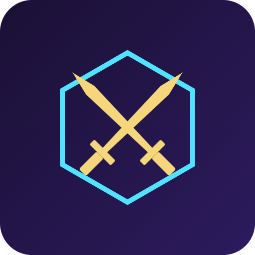

# ChainBrawl


Fully on-chain autobattler where every fight is computed and verified on Solana.

## Overview

ChainBrawl is a PvP autobattler where character stats, battle logic, and randomness all live on-chain. Players mint a fighter NFT, auto-battle against others using deterministic on-chain logic plus VRF-based randomness, and climb a ranked ladder for token rewards. Everything that determines the outcome of a fight can be verified directly on Solana.

## Problem

Most "blockchain games" only put a shop or item marketplace on-chain. The actual gameplay and match outcomes still happen on centralized servers, so players have no way to verify that results are fair or untampered with.

## Solution

ChainBrawl moves battle resolution itself on-chain. An Anchor program combines fighter stats with Switchboard VRF randomness to produce a fully verifiable and replayable combat outcome. There is no hidden server deciding who wins.

## Features (MVP)

- Mint a fighter NFT with randomized on-chain stats
- On-chain battle resolution program using VRF for fair randomness
- Ranked ladder with on-chain leaderboard PDA
- Stake SOL/tokens to enter matches with on-chain escrow payout
- Simple web client to view replay of each on-chain battle

## Tech stack

- Anchor (Solana program framework)
- Switchboard VRF (verifiable randomness)
- Solana Program Library (SPL)
- Metaplex NFT standard
- React
- Solana Web3.js

## How it works

User flow: mint a fighter -> stake tokens -> enter a match -> on-chain program resolves the battle -> leaderboard and payout update -> client renders the replay.

```
[Player Wallet]
      |
      v
[Mint Fighter NFT] --(Metaplex)--> [Fighter Stats Account]
      |
      v
[Stake & Enter Match] --(SPL escrow)--> [Match Account]
      |
      v
[Battle Resolution Program] <--(Switchboard VRF)-- [Randomness]
      |
      v
[Leaderboard PDA] + [Escrow Payout]
      |
      v
[React Client] --(reads on-chain state)--> [Battle Replay View]
```

All combat math, stat storage, randomness consumption, ranking, and payout logic execute inside the Anchor program on Solana. The React client is a thin viewer that reads on-chain state and renders a replay; it does not decide outcomes.

## Roadmap

- Add matchmaking and seasonal tournaments with prize pools
- Expand to multiplayer team battles (3v3)
- Open an SDK so other studios can plug in on-chain battle resolution

## Pitch

See the full pitch deck at [docs/pitch.pdf](docs/pitch.pdf) and the spoken pitch script at [docs/pitch-script.md](docs/pitch-script.md).

## Team

- Name - Role - [GitHub](#) / [Twitter](#)
- Name - Role - [GitHub](#) / [Twitter](#)
- Name - Role - [GitHub](#) / [Twitter](#)

---

🎬 Pitch video: [docs/pitch-video.mp4](docs/pitch-video.mp4)


## Prototype

Live prototype: https://shimayoko.github.io/chainbrawl/

The source is [docs/index.html](docs/index.html) (served with GitHub Pages from the /docs folder). All data is simulated.
